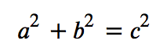
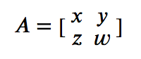

* 浏览器对无法识别的元素会作为内联元素自动处理
* [让较早的浏览器支持 HTML5](http://www.runoob.com/html/html5-browsers.html)


## Canvas

* 默认情况下 <canvas> 元素没有边框和内容

```html
<!-- 使用 style 属性来添加边框 -->
<canvas id="myCanvas" width="200" height="100"
style="border:1px solid #000000;">
</canvas>
```

* 使用 JavaScript 来绘制图像

```html
<!-- canvas 元素本身是没有绘图能力的，所有的绘制工作必须在 JavaScript 内部完成 -->
<!DOCTYPE html>
<html>
<head> 
	<meta charset="utf-8"> 
	<title>菜鸟教程(runoob.com)</title> 
</head>
<body>

<canvas id="myCanvas" width="200" height="100" style="border:1px solid #c3c3c3;">
	您的浏览器不支持 HTML5 canvas 标签。
</canvas>

<script>
	var c=document.getElementById("myCanvas");
// 创建 context 对象
// getContext("2d") 对象是内建的 HTML5 对象，拥有多种绘制路径、矩形、圆形、字符以及添加图像的方法。
	var ctx=c.getContext("2d");
// 设置 fillStyle 属性可以是 CSS 颜色，渐变，或图案
	ctx.fillStyle="#FF0000";
	ctx.fillRect(0,0,150,75);
</script>

</body>
</html>
```

* 在Canvas上画线，我们将使用以下两种方法

  * moveTo(x,y) 定义线条开始坐标
  * lineTo(x,y) 定义线条结束坐标

  ```javascript
  var c=document.getElementById("myCanvas");
  var ctx=c.getContext("2d");
  ctx.moveTo(0,0);
  ctx.lineTo(200,100);
  ctx.stroke();
  ```

[Canvas More](http://www.runoob.com/html/html5-canvas.html)


## 内联 SVG

* SVG 使用 XML 格式定义图形

### SVG优势

与其他图像格式相比（比如 JPEG 和 GIF），使用 SVG 的优势在于：

- SVG 图像可通过文本编辑器来创建和修改
- SVG 图像可被搜索、索引、脚本化或压缩
- SVG 是可伸缩的
- SVG 图像可在任何的分辨率下被高质量地打印
- SVG 可在图像质量不下降的情况下被放大

```html
<!-- 把 SVG 直接嵌入 HTML 页面 -->
<!DOCTYPE html>
<html>
<body>
 
<svg xmlns="http://www.w3.org/2000/svg" version="1.1" height="190">
  <polygon points="100,10 40,180 190,60 10,60 160,180"
  style="fill:lime;stroke:purple;stroke-width:5;fill-rule:evenodd;">
</svg>
 
</body>
</html>
```


## MathML

```html
<math>...</math>
```

### Eg

```html
<!DOCTYPE html>
<html>
   <head>
      <meta charset="UTF-8">
      <title>菜鸟教程(runoob.com)</title>
   </head>
    
   <body>
    
      <math xmlns="http://www.w3.org/1998/Math/MathML">
         <mrow>
            <msup><mi>a</mi><mn>2</mn></msup>
            <mo>+</mo>
                
            <msup><mi>b</mi><mn>2</mn></msup>
            <mo>=</mo>
                
            <msup><mi>c</mi><mn>2</mn></msup>
         </mrow>
            
      </math>
        
   </body>
</html> 
```

结果



```html
<!DOCTYPE html>
<html>
   <head>
      <meta charset="UTF-8">
      <title>菜鸟教程(runoob.com)</title>
   </head>
    
   <body>
      <math xmlns="http://www.w3.org/1998/Math/MathML">
         <mrow>
            <mi>A</mi>
            <mo>=</mo>
            
            <mfenced open="[" close="]">
            
               <mtable>
                  <mtr>
                     <mtd><mi>x</mi></mtd>
                     <mtd><mi>y</mi></mtd>
                  </mtr>
                    
                  <mtr>
                     <mtd><mi>z</mi></mtd>
                     <mtd><mi>w</mi></mtd>
                  </mtr>
               </mtable>
               
            </mfenced>
         </mrow>
      </math>
      
   </body>
</html> 
```

结果



## 拖放

Grag and Drop

### [Eg](http://www.runoob.com/html/html5-draganddrop.html)

```html

<!DOCTYPE HTML>
<html>
<head>
	<meta charset="utf-8"> 
	<title>菜鸟教程(runoob.com)</title>
	<style type="text/css">
	#div1 {width:350px;height:70px;padding:10px;border:1px solid #aaaaaa;}
</style>
<script>
	function allowDrop(ev){
    	ev.preventDefault();
	}
	function drag(ev){
   		// dataTransfer.setData() 方法设置被拖数据的数据类型和值
      	// 数据类型是 "Text"，值是可拖动元素的 id ("drag1")
    	ev.dataTransfer.setData("Text",ev.target.id);	
	}
	function drop(ev){
    	ev.preventDefault();
   		var data=ev.dataTransfer.getData("Text");
    	ev.target.appendChild(document.getElementById(data));
	}
</script>
</head>
<body>

	<p>拖动 RUNOOB.COM 图片到矩形框中:</p>

	<div id="div1" ondrop="drop(event)" ondragover="allowDrop(event)"></div>
	<br>
	

</body>
</html>
```


## 地理位置

Geolocation

### Eg

```javascript
var x=document.getElementById("demo");
function getLocation(){
    if (navigator.geolocation){
        navigator.geolocation.getCurrentPosition(showPosition);
    }
    else{
        x.innerHTML="该浏览器不支持获取地理位置。";
    }
}
 
function showPosition(position){
    x.innerHTML="纬度: " + position.coords.latitude + 
    "<br>经度: " + position.coords.longitude;    
}
```


## Video

Eg

```html
<video width="320" height="240" controls>
  <source src="movie.mp4" type="video/mp4">
  <source src="movie.ogg" type="video/ogg">
您的浏览器不支持Video标签。
</video>
```

* <video> 与</video> 标签之间插入的内容是提供给不支持 video 元素的浏览器显示的。


* <video> 元素支持多个 <source> 元素，<source> 元素可以链接不同的视频文件。浏览器将使用第一个可识别的格式。
* <video> 元素支持三种视频格式： MP4, WebM, 和 Ogg

### Eg：使用 DOM 进行控制

```html
<!DOCTYPE html> 
<html> 
<head> 
<meta charset="utf-8"> 
<title>菜鸟教程(runoob.com)</title> 
</head>
<body> 

<div style="text-align:center"> 
  <button onclick="playPause()">播放/暂停</button> 
  <button onclick="makeBig()">放大</button>
  <button onclick="makeSmall()">缩小</button>
  <button onclick="makeNormal()">普通</button>
  <br> 
  <video id="video1" width="420">
    <source src="mov_bbb.mp4" type="video/mp4">
    <source src="mov_bbb.ogg" type="video/ogg">
    您的浏览器不支持 HTML5 video 标签。
  </video>
</div> 

<script> 
	var myVideo=document.getElementById("video1"); 

    function playPause(){ 
    	if (myVideo.paused) 
        	myVideo.play(); 
        else 
          	myVideo.pause(); 
    } 
    function makeBig(){ 
        myVideo.width=560; 
    } 
    function makeSmall(){ 
        myVideo.width=320; 
    } 
    function makeNormal(){ 
        myVideo.width=420; 
    } 
</script> 

</body> 
</html>
```


## Audio

Eg

```html
<audio controls>
  <source src="horse.ogg" type="audio/ogg">
  <source src="horse.mp3" type="audio/mpeg">
您的浏览器不支持 audio 元素。
</audio>
```


## Web 存储

### localStorage

* localStorage 对象存储的数据没有时间限制，第二天、第二周或下一年之后，数据依然可用。

```javascript
// 检测是否支持
if(typeof(Storage)!=="undefined"){
    // 是的! 支持 localStorage  sessionStorage 对象!
    // 一些代码.....
} 
else {
    // 抱歉! 不支持 web 存储。
}
```

eg

```html
<!DOCTYPE html>
<html>
<head> 
	<meta charset="utf-8"> 
	<title>菜鸟教程(runoob.com)</title> 
</head>
<body>

<div id="result"></div>
<script>
    if(typeof(Storage)!=="undefined"){
    	localStorage.sitename="菜鸟教程";
     	document.getElementById("result").innerHTML="网站名：" + localStorage.sitename;
    }
    else{
      	document.getElementById("result").innerHTML="对不起，您的浏览器不支持 web 存储。";
    }
</script>

</body>
</html>
```

* 保存数据
  * localStorage.setItem(key,value);
* 读取数据
  * localStorage.getItem(key);
* 删除单个数据
  * localStorage.removeItem(key);
* 删除所有数据
  * localStorage.clear();
* 得到某个索引的key
  * localStorage.key(index);


### sessionStorage

* sessionStorage 方法针对一个 session 进行数据存储，当用户关闭浏览器窗口后，数据会被删除。


