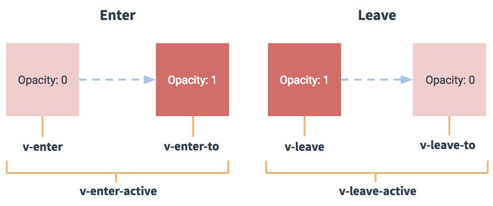

## 单元素 / 组件的过渡

Vue 提供了 `transition` 的封装组件，在下列情形中，可以给任何元素和组件添加 entering/leaving 过渡

- 条件渲染 (使用 `v-if`)
- 条件展示 (使用 `v-show`)
- 动态组件
- 组件根节点

这里是一个典型的例子：

```html
<div id="demo">
  <button v-on:click="show = !show">
    Toggle
  </button>
  <transition name="fade">
    <p v-if="show">hello</p>
  </transition>
</div>
```

```js
new Vue({
  el: '#demo',
  data: {
    show: true
  }
})
```

```css
.fade-enter-active, .fade-leave-active {
  transition: opacity .5s
}
.fade-enter, .fade-leave-to /* .fade-leave-active in below version 2.1.8 */ {
  opacity: 0
}
```

当插入或删除包含在 `transition` 组件中的元素时，Vue 将会做以下处理：

1. 自动嗅探目标元素是否应用了 CSS 过渡或动画，如果是，在恰当的时机添加/删除 CSS 类名。
2. 如果过渡组件提供了 [JavaScript 钩子函数](https://cn.vuejs.org/v2/guide/transitions.html#JavaScript-%E9%92%A9%E5%AD%90)，这些钩子函数将在恰当的时机被调用。
3. 如果没有找到 JavaScript 钩子并且也没有检测到 CSS 过渡/动画，DOM 操作 (插入/删除) 在下一帧中立即执行。(注意：此指浏览器逐帧动画机制，和 Vue 的 `nextTick` 概念不同)


#### 过渡的类名

在进入/离开的过渡中，会有 6 个 class 切换。

1. `v-enter`：定义进入过渡的开始状态。在元素被插入时生效，在下一个帧移除。
2. `v-enter-active`：定义过渡的状态。在元素整个过渡过程中作用，在元素被插入时生效，在 `transition/animation` 完成之后移除。这个类可以被用来定义过渡的过程时间，延迟和曲线函数。
3. `v-enter-to`: **2.1.8版及以上** 定义进入过渡的结束状态。在元素被插入一帧后生效 (于此同时 `v-enter` 被删除)，在 `transition/animation` 完成之后移除。
4. `v-leave`: 定义离开过渡的开始状态。在离开过渡被触发时生效，在下一个帧移除。
5. `v-leave-active`：定义过渡的状态。在元素整个过渡过程中作用，在离开过渡被触发后立即生效，在 `transition/animation` 完成之后移除。这个类可以被用来定义过渡的过程时间，延迟和曲线函数。
6. `v-leave-to`: **2.1.8版及以上** 定义离开过渡的结束状态。在离开过渡被触发一帧后生效 (于此同时 `v-leave` 被删除)，在 `transition/animation` 完成之后移除。



对于这些在 `enter/leave` 过渡中切换的类名，`v-` 是这些类名的前缀。使用 `<transition name="my-transition">` 可以重置前缀，比如 `v-enter` 替换为 `my-transition-enter`。

`v-enter-active` 和 `v-leave-active` 可以控制 进入/离开 过渡的不同阶段，在下面章节会有个示例说明。


#### css 过渡

```html
<div id="example-1">
  <button @click="show = !show">
    Toggle render
  </button>
  <transition name="slide-fade">
    <p v-if="show">hello</p>
  </transition>
</div>
```

```js
new Vue({
  el: '#example-1',
  data: {
    show: true
  }
})
```

```css
/* 可以设置不同的进入和离开动画 */
/* 设置持续时间和动画函数 */
.slide-fade-enter-active {
  transition: all .3s ease;
}
.slide-fade-leave-active {
  transition: all .8s cubic-bezier(1.0, 0.5, 0.8, 1.0);
}
.slide-fade-enter, .slide-fade-leave-to
/* .slide-fade-leave-active for below version 2.1.8 */ {
  transform: translateX(10px);
  opacity: 0;
}
```


#### css 动画

CSS 动画用法同 CSS 过渡，区别是在动画中 `v-enter` 类名在节点插入 DOM 后不会立即删除，而是在 `animationend` 事件触发时删除。

```html
<div id="example-2">
  <button @click="show = !show">Toggle show</button>
  <transition name="bounce">
    <p v-if="show">Lorem ipsum dolor sit amet, consectetur adipiscing elit. Mauris facilisis enim libero, at lacinia diam fermentum id. Pellentesque habitant morbi tristique senectus et netus.</p>
  </transition>
</div>
```

```js
new Vue({
  el: '#example-2',
  data: {
    show: true
  }
})
```

```css
.bounce-enter-active {
  animation: bounce-in .5s;
}
.bounce-leave-active {
  animation: bounce-in .5s reverse;
}
@keyframes bounce-in {
  0% {
    transform: scale(0);
  }
  50% {
    transform: scale(1.5);
  }
  100% {
    transform: scale(1);
  }
}
```


#### 自定义过渡的类名

我们可以通过以下特性来自定义过渡类名：

- `enter-class`
- `enter-active-class`
- `enter-to-class` (2.1.8+)
- `leave-class`
- `leave-active-class`
- `leave-to-class` (2.1.8+)

他们的优先级高于普通的类名，这对于 Vue 的过渡系统和其他第三方 CSS 动画库，如 [Animate.css](https://daneden.github.io/animate.css/)结合使用十分有用。

```html
<link href="https://cdn.jsdelivr.net/npm/animate.css@3.5.1" rel="stylesheet" type="text/css">
<div id="example-3">
  <button @click="show = !show">
    Toggle render
  </button>
  <transition
    name="custom-classes-transition"
    enter-active-class="animated tada"
    leave-active-class="animated bounceOutRight"
  >
    <p v-if="show">hello</p>
  </transition>
</div>
```

```js
new Vue({
  el: '#example-3',
  data: {
    show: true
  }
})
```


