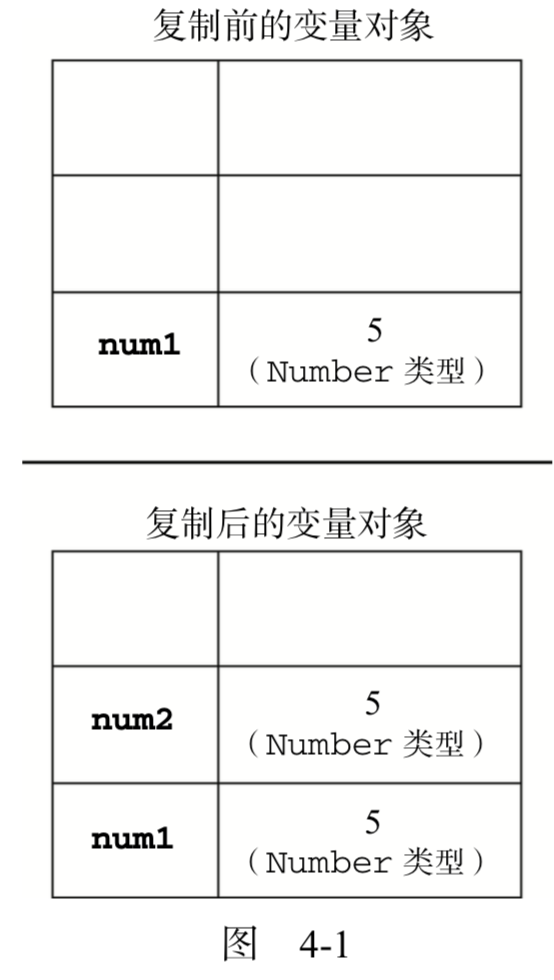
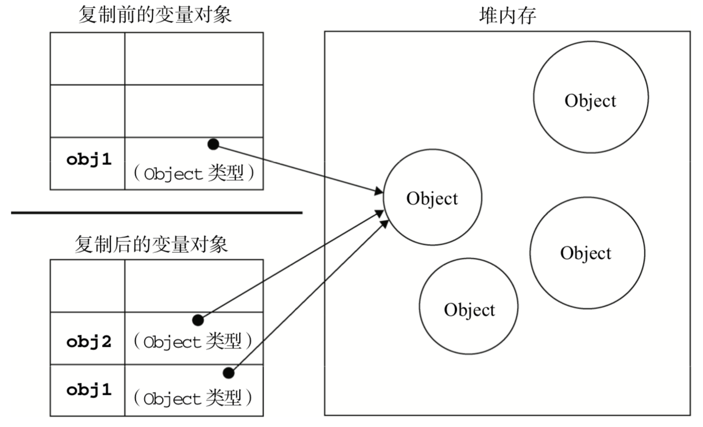

## 第二章

* <script> 元素放在 <body> 最后可以加快网页展示的速度

#### 在 XHTML 中的语法

* 32页 P14

#### <noscript>元素

* 在下列情况才会显示
  * 浏览器不支持脚本
  * 浏览器支持脚本，但脚本被禁用


## 第三章

* 其他类型和 Boolean 之间的转换

|  数据类型  | 转换为 true 的值 | 转换为  false 的值 |
| :----: | :---------: | :-----------: |
| String |     非空      |      ""       |
| Number |   非零和无穷大    |    0 和 NaN    |
| Object |    任何对象     |     null      |

### 位操作

#### 左移

```javascript
<<

2 << 5 = 64
-2 << 5 = -64
// 左移不会改变符号
```

#### 有符号右移

```javascript
>>
// 符号位不动
```

#### 无符号右移

```javascript
>>>
// 符号位一起移动
```

### 函数

#### 参数

* 函数定义的参数和传入的参数并不需要一一对应，可以通过 argument[*] 访问。
* func( p0, p1, p2, p3, …… ) 和 argument
  * p0 = argument[0]
  * p1 = argument[1]
  * p* = argument[*]


## 第四章

* 基本类型值和引用类型

  * 基本类型值

    * 简单数据段
    * 复制赋值
    * 

  * 引用类型值

    * 由多值构成的对象
    * 复制赋值
    * 

  * 传递参数

    * 函数的参数是按值传递的，和把值从一个变量复制到另一个变量一样

  * 检查类型

    * typeof

    * instanceof

    ```javascript
    result = variable instanceof constructor
    // 根据他的原型链来识别
    ```

* 执行环境及作用域

  * 全局执行环境的变量对象始终是作用域链中的最后一个对象
  * 延长作用域链
    * try-catch 语句的 catch 块
  * 没有块级作用域


