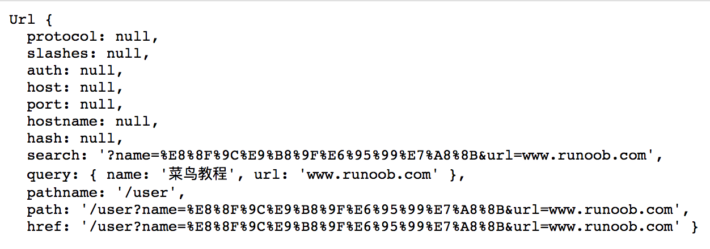
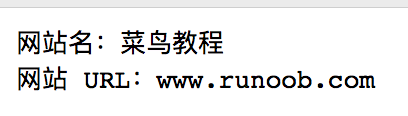

> [Node.js 教程](http://www.runoob.com/nodejs/nodejs-tutorial.html)

## REPL

### 下划线 _

* 获取表达式结果

  ```Javascript
  $ node
  > var x = 10
  undefined
  > var y = 20
  undefined
  > x + y
  30
  > var sum = _	// _ 表示获取表达式结果
  undefined
  > console.log(sum)
  30
  undefined
  >
  ```


## EventEmitter

### eg

```javascript
// 引入 events 模块
var events = require('events');
var eventEmitter = new events.EventEmitter();

// 监听器 #1
var listener1 = function listener1() {
   console.log('监听器 listener1 执行。');
}

// 监听器 #2
var listener2 = function listener2() {
  console.log('监听器 listener2 执行。');
}

// 绑定 connection 事件，处理函数为 listener1 
eventEmitter.addListener('connection', listener1);

// 绑定 connection 事件，处理函数为 listener2
eventEmitter.on('connection', listener2);

var eventListeners = require('events').EventEmitter.listenerCount(eventEmitter,'connection');
console.log(eventListeners + " 个监听器监听连接事件。");

// 处理 connection 事件 
eventEmitter.emit('connection');

// 移除监绑定的 listener1 函数
eventEmitter.removeListener('connection', listener1);
console.log("listener1 不再受监听。");

// 触发连接事件
eventEmitter.emit('connection');

eventListeners = require('events').EventEmitter.listenerCount(eventEmitter,'connection');
console.log(eventListeners + " 个监听器监听连接事件。");

console.log("程序执行完毕。");

// $ node main.js
// output:
2 个监听器监听连接事件。
监听器 listener1 执行。
监听器 listener2 执行。
listener1 不再受监听。
监听器 listener2 执行。
1 个监听器监听连接事件。
程序执行完毕。
```

### 属性

> [参考手册](http://www.runoob.com/nodejs/nodejs-event.html)


#### error 事件

```
EventEmitter 定义了一个特殊的事件 error，它包含了错误的语义，在遇到异常的时候通常会触发 error 事件。
当 error 被触发时，EventEmitter 规定如果没有响应的监听器，Node.js 会把它当作异常，退出程序并输出错误信息。
我们一般要为会触发 error 事件的对象设置监听器，避免遇到错误后整个程序崩溃。
```


## Buffer

```
JavaScript 语言自身只有字符串数据类型，没有二进制数据类型。但在处理像 TCP 流或文件流时，必须使用到二进制数据。因此在 Node.js中，定义了一个 Buffer 类，该类用来创建一个专门存放二进制数据的缓存区。
```

```
一个 Buffer 类似于一个整数数组，但它对应于 V8 堆内存之外的一块原始内存。
```


### 创建

```javascript
// 长度为 10 字节的 Buffer
var buf = new Buffer(10);
```

```javascript
// 通过给定的数组创建
var buf = new Buffer([10, 20, 30, 40, 50]);
```

```javascript
// 通过字符串创建
var buf = new Buffer("www.runoob.com", "utf-8");
// utf-8 是默认编码方式，同样支持"ascii", "utf8", "utf16le", "ucs2", "base64" 和 "hex"。
```


### 写入缓冲区

```javascript
// 语法
buf.write(string[, offset[, length]][, encoding])
```

```javascript
// string - 写入缓冲区的字符串。
// offset - 缓冲区开始写入的索引值，默认为 0 。
// length - 写入的字节数，默认为 buffer.length
// encoding - 使用的编码。默认为 'utf8' 。
```

```javascript
// 返回实际写入的大小。如果 buffer 空间不足，则只会写入部分字符串。
```


### 从缓冲区读取数据

```javascript
// 语法
buf.toString([encoding[, start[, end]]])
```

```javascript
// encoding - 使用的编码。默认为 'utf8' 。
// start - 指定开始读取的索引位置，默认为 0。
// end - 结束位置，默认为缓冲区的末尾。
```

```javascript
// eg
buf = new Buffer(26);
for (var i = 0 ; i < 26 ; i++) {
  buf[i] = i + 97;
}

console.log( buf.toString('ascii') );       // 输出: abcdefghijklmnopqrstuvwxyz
console.log( buf.toString('ascii',0,5) );   // 输出: abcde
console.log( buf.toString('utf8',0,5) );    // 输出: abcde
console.log( buf.toString(undefined,0,5) ); // 使用 'utf8' 编码, 并输出: abcde
```


### 转换为 JSON 对象

```javascript
// 语法
buf.toJSON()
```

```javascript
// eg
var buf = new Buffer('www.runoob.com');
var json = buf.toJSON(buf);

console.log(json);
// output:
[ 119, 119, 119, 46, 114, 117, 110, 111, 111, 98, 46, 99, 111, 109 ]
```


### 缓冲区合并

```javascript
// 语法
Buffer.concat(list[, totalLength])
```

```javascript
// list - 用于合并的 Buffer 对象数组列表。
// totalLength - 指定合并后Buffer对象的总长度。
```

```javascript
// eg
var buffer1 = new Buffer('菜鸟教程 ');
var buffer2 = new Buffer('www.runoob.com');
var buffer3 = Buffer.concat([buffer1,buffer2]);
console.log("buffer3 内容: " + buffer3.toString());
// output:
buffer3 内容: 菜鸟教程 www.runoob.com
```


### 缓冲区拷贝

```javascript
buf.copy(targetBuffer[, targetStart[, sourceStart[, sourceEnd]]])
```


### 缓冲区裁剪

```javascript
buf.slice([start[, end]])
```

``` javascript
// 和 str.subString([start[, end]]) 参数类似
```

```javascript
// 返回一个新的缓冲区，它和旧缓冲区指向同一块内存，但是从索引 start 到 end 的位置剪切。
```


> [参考手册](http://www.runoob.com/nodejs/nodejs-buffer.html)


## Steam

```
所有的 Stream 对象都是 EventEmitter 的实例。常用的事件有：

data	当有数据可读时触发。
end		没有更多的数据可读时触发。
error	在接收和写入过程中发生错误时触发。
finish	所有数据已被写入到底层系统时触发。
```


### 从流中读数据

```javascript
// 创建 input.txt 文件，内容如下：
// 菜鸟教程官网地址：www.runoob.com

// 创建 main.js 文件, 代码如下：
var fs = require("fs");
var data = '';

// 创建可读流
var readerStream = fs.createReadStream('input.txt');

// 设置编码为 utf8。
readerStream.setEncoding('UTF8');

// 处理流事件 --> data, end, and error
readerStream.on('data', function(chunk) {
   data += chunk;
});

readerStream.on('end',function(){
   console.log(data);
});

readerStream.on('error', function(err){
   console.log(err.stack);
});

console.log("程序执行完毕");

// output:
程序执行完毕
菜鸟教程官网地址：www.runoob.com
```


### 写入流

```javascript
var fs = require("fs");
var data = '菜鸟教程官网地址：www.runoob.com';

// 创建一个可以写入的流，写入到文件 output.txt 中
var writerStream = fs.createWriteStream('output.txt');

// 使用 utf8 编码写入数据
writerStream.write(data,'UTF8');

// 标记文件末尾
writerStream.end();

// 处理流事件 --> data, end, and error
writerStream.on('finish', function() {
    console.log("写入完成");
});

writerStream.on('error', function(err){
   console.log(err.stack);
});

console.log("程序执行完毕");

// 以上程序会将 data 变量的数据写入到 output.txt 文件中
// output:
程序执行完毕
写入完成
```


### 管道流

用于从一个流中获取数据并将数据传递到另外一个流中

```javascript
var fs = require("fs");

// 创建一个可读流
var readerStream = fs.createReadStream('input.txt');

// 创建一个可写流
var writerStream = fs.createWriteStream('output.txt');

// 管道读写操作
// 读取 input.txt 文件内容，并将内容写入到 output.txt 文件中
readerStream.pipe(writerStream);
```


### 链式流

通过连接输出流到另外一个流并创建多个对个流操作链的机制。链式流一般用于管道操作。

```javascript
// 用管道和链式来压缩和解压文件
```

```javascript
// 创建 compress.js 文件, 代码如下：
var fs = require("fs");
var zlib = require('zlib');

// 压缩 input.txt 文件为 input.txt.gz
fs.createReadStream('input.txt')
  .pipe(zlib.createGzip())
  .pipe(fs.createWriteStream('input.txt.gz'));
```

```javascript
// 创建 decompress.js 文件，代码如下：
var fs = require("fs");
var zlib = require('zlib');

// 解压 input.txt.gz 文件为 input.txt
fs.createReadStream('input.txt.gz')
  .pipe(zlib.createGunzip())
  .pipe(fs.createWriteStream('input.txt'));
```


## 模块系统

```javascript
var hello = require('./hello');
hello.world();
// 代码 require('./hello') 引入了当前目录下的 hello.js 文件（node.js 默认后缀为 js）
```

Node.js 提供了 exports 和 require 两个对象，其中 exports 是模块公开的接口，require 用于从外部获取一个模块的接口，即所获取模块的 exports 对象。

```javascript
// hello.js
exports.world = function() {
  console.log('Hello World');
}
// 通过 require('./hello') 加载这个模块，然后就可以直接访问 hello.js 中 exports 对象的成员函数了
```


### 对象封装到模块中

```javascript
// 格式
module.exports = function() {
  // ...
}
```

```javascript
// hello.js 
function Hello() { 
    var name; 
    this.setName = function(thyName) { 
        name = thyName; 
    }; 
    this.sayHello = function() { 
        console.log('Hello ' + name); 
    }; 
}; 
module.exports = Hello;
```

```javascript
// 这样就可以直接获得这个对象了
// main.js 
var Hello = require('./hello'); 
hello = new Hello(); 
hello.setName('BYVoid'); 
hello.sayHello(); 
```


>[require 执行顺序](http://www.runoob.com/nodejs/nodejs-module-system.html)


## 路由

[Node.js 路由](http://www.runoob.com/nodejs/nodejs-router.html)


## 全局变量

Node.js 中的全局对象是 global，所有全局变量（除了 global 本身以外）都是 global 对象的属性。

```
1. 在最外层定义的变量
2. 全局对象的属性
3. 隐式定义的变量（未定义直接赋值的变量）
```


### __filename

```
表示当前正在执行的脚本的文件名
它将输出文件所在位置的绝对路径，且和命令行参数所指定的文件名不一定相同
如果在模块中，返回的值是模块文件的路径
```

```javascript
// 输出全局变量 __filename 的值
console.log( __filename );
```


### __dirname

表示当前执行脚本所在的目录。

```javascript
// 输出全局变量 __dirname 的值
console.log( __dirname );
```


### setTimeout(cb, ms)

```
setTimeout(cb, ms) 全局函数在指定的毫秒(ms)数后执行指定函数(cb)。
setTimeout() 只执行一次指定函数。
返回一个代表定时器的句柄值。
```

```javascript
function printHello(){
   console.log( "Hello, World!");
}
// 两秒后执行以上函数
setTimeout(printHello, 2000);
```


### clearTimeout(t)

```
clearTimeout(t) 全局函数用于停止一个之前通过 setTimeout() 创建的定时器。
参数 t 是通过 setTimeout() 函数创建的定时器。
```

```javascript
function printHello(){
   console.log( "Hello, World!");
}
// 两秒后执行以上函数
var t = setTimeout(printHello, 2000);

// 清除定时器
clearTimeout(t);
```


### setInterval(cb, ms)

```
setInterval(cb, ms) 全局函数在指定的毫秒(ms)数后执行指定函数(cb)
返回一个代表定时器的句柄值。可以使用 clearInterval(t) 函数来清除定时器
setInterval() 方法会不停地调用函数，直到 clearInterval() 被调用或窗口被关闭
```


### console

用于向标准输出流（stdout）或标准错误流（stderr）输出字符。

```javascript
// console.log()：向标准输出流打印字符并以换行符结束。
// console.log 接收若干个参数，如果只有一个参数，则输出这个参数的字符串形式。如果有多个参数，则以类似于C 语言 printf() 命令的格式输出。
console.log('Hello world'); 
console.log('byvoid%diovyb'); 
console.log('byvoid%diovyb', 1991); 

// output:
Hello world 
byvoid%diovyb 
byvoid1991iovyb
```

```javascript
// 用来对一个对象进行检查（inspect），并以易于阅读和打印的格式显示
console.dir(obj[, options]);
```

```javascript
// 输出时间，表示计时开始
console.time(label);

// 结束时间，表示计时结束
console.timeEnd(label);
```

```javascript
// 当前执行的代码在堆栈中的调用路径
// 这个测试函数运行很有帮助，只要给想测试的函数里面加入 console.trace
console.trace(message[, ...]);
```

```javascript
console.assert(value[, message][, ...])
```


### process

用于描述当前 Node.js 进程状态的对象，提供了一个与操作系统的简单接口


>[process 属性](http://www.runoob.com/nodejs/nodejs-global-object.html)


## Node.js 常用工具

### util

Node.js 核心模块，提供常用函数的集合，用于弥补核心JavaScript 的功能 过于精简的不足


#### util.inherits

util.inherits(constructor, superConstructor) 是一个实现对象间原型继承的函数

```javascript
// eg
var util = require('util'); 
function Base() { 
    this.name = 'base'; 
    this.base = 1991; 
    this.sayHello = function() { 
    console.log('Hello ' + this.name); 
    }; 
} 
Base.prototype.showName = function() { 
    console.log(this.name);
}; 
function Sub() { 
    this.name = 'sub'; 
} 

util.inherits(Sub, Base); 

var objBase = new Base(); 
objBase.showName(); 
objBase.sayHello(); 
console.log(objBase); 

var objSub = new Sub(); 
objSub.showName(); 
console.log(objSub); 

// ouput:
base 
Hello base 
{ name: 'base', base: 1991, sayHello: [Function] } 
sub 
{ name: 'sub' }

// Sub 仅仅继承了Base 在原型中定义的函数，而构造函数内部创造的 base 属 性和 sayHello 函数都没有被 Sub 继承。
```


#### util.inspect

```
util.inspect(object, [showHidden], [depth], [colors]) 是一个将任意对象转换为字符串的方法，通常用于调试和错误输出。它至少接受一个参数 object，即要转换的对象。
```

```
showHidden 是一个可选参数，如果值为 true，将会输出更多隐藏信息。
depth 表示最大递归的层数，如果对象很复杂，你可以指定层数以控制输出信息的多少。如果不指定depth，默认会递归2层，指定为 null 表示将不限递归层数完整遍历对象。
如果 color 值为 true，输出格式将会以 ANSI 颜色编码，通常用于在终端显示更漂亮的效果。
```


```javascript
// 如果给定的参数 "object" 是一个数组返回true，否则返回false。
util.isArray(object)

// 如果给定的参数 "object" 是一个正则表达式返回true，否则返回false。
util.isRegExp(object)

// 如果给定的参数 "object" 是一个日期返回true，否则返回false。
util.isDate(object)

// 如果给定的参数 "object" 是一个错误对象返回true，否则返回false。
util.isError(object)
```


## 文件系统

> 见 `Nodejs File System.md` 


## GET/POST请求

### 获取GET请求内容

```javascript
由于 GET 请求直接被嵌入在路径中，URL 是完整的请求路径，包括了?后面的部分，因此可以手动解析后面的内容作为 GET 请求的参数。
node.js 中 url 模块中的 parse 函数提供了这个功能
```

```javascript
// eg
var http = require('http');
var url = require('url');
var util = require('util');
 
http.createServer(function(req, res){
    res.writeHead(200, {'Content-Type': 'text/plain; charset=utf-8'});
    res.end(util.inspect(url.parse(req.url, true)));
}).listen(3000);
```

```javascript
在浏览器中访问: http://localhost:3000/user?name=菜鸟教程&url=www.runoob.com
```



---


#### 获取 URL 的参数

```javascript
var http = require('http');
var url = require('url');
var util = require('util');
 
http.createServer(function(req, res){
    res.writeHead(200, {'Content-Type': 'text/plain'});
 
    // 解析 url 参数
    var params = url.parse(req.url, true).query;
    res.write("网站名：" + params.name);
    res.write("\n");
    res.write("网站 URL：" + params.url);
    res.end();
 
}).listen(3000);
```

```javascript
在浏览器中访问 http://localhost:3000/user?name=菜鸟教程&url=www.runoob.com 
```



---


### 获取 POST 请求内容

```javascript
POST 请求的内容全部的都在请求体中，http.ServerRequest 并没有一个属性内容为请求体，原因是等待请求体传输可能是一件耗时的工作。
比如上传文件，而很多时候可能并不需要理会请求体的内容，恶意的 POST 请求会大大消耗服务器的资源，所以 node.js 默认是不会解析请求体的。
需要的时候可以手动来做。
```

```javascript
var http = require('http');
var querystring = require('querystring');
 
http.createServer(function(req, res){
    // 定义了一个post变量，用于暂存请求体的信息
    var post = '';     
 
    // 通过req的data事件监听函数，每当接受到请求体的数据，就累加到post变量中
    req.on('data', function(chunk){    
        post += chunk;
    });
 
    // 在end事件触发后，通过querystring.parse将post解析为真正的POST请求格式，然后向客户端返回。
    req.on('end', function(){    
        post = querystring.parse(post);
        res.end(util.inspect(post));
    });
}).listen(3000);
```

```javascript
// eg
var http = require('http');
var querystring = require('querystring');
 
var postHTML = 
  '<html><head><meta charset="utf-8"><title>菜鸟教程 Node.js 实例</title></head>' +
  '<body>' +
  '<form method="post">' +
  '网站名： <input name="name"><br>' +
  '网站 URL： <input name="url"><br>' +
  '<input type="submit">' +
  '</form>' +
  '</body></html>';
 
http.createServer(function (req, res) {
  var body = "";
  req.on('data', function (chunk) {
    body += chunk;
  });
  req.on('end', function () {
    // 解析参数
    body = querystring.parse(body);
    // 设置响应头部信息及编码
    res.writeHead(200, {'Content-Type': 'text/html; charset=utf8'});
 
    if(body.name && body.url) { // 输出提交的数据
        res.write("网站名：" + body.name);
        res.write("<br>");
        res.write("网站 URL：" + body.url);
    } else {  // 输出表单
        res.write(postHTML);
    }
    res.end();
  });
}).listen(3000);
```


## 工具模块

>见 `Nodejs 工具模块.md` 


## Web 模块

### 创建 Web 服务器

```javascript
// Node.js 提供了 http 模块，主要用于搭建 HTTP 服务端和客户端
var http = require('http');
```

eg:

```javascript
// 演示一个最基本的 HTTP 服务器架构
// 使用8081端口
// 创建 server.js 文件
var http = require('http');
var fs = require('fs');
var url = require('url');


// 创建服务器
http.createServer( function (request, response) {  
   // 解析请求，包括文件名
   var pathname = url.parse(request.url).pathname;
   
   // 输出请求的文件名
   console.log("Request for " + pathname + " received.");
   
   // 从文件系统中读取请求的文件内容
   fs.readFile(pathname.substr(1), function (err, data) {
      if (err) {
         console.log(err);
         // HTTP 状态码: 404 : NOT FOUND
         // Content Type: text/plain
         response.writeHead(404, {'Content-Type': 'text/html'});
      }else{             
         // HTTP 状态码: 200 : OK
         // Content Type: text/plain
         response.writeHead(200, {'Content-Type': 'text/html'});    
         
         // 响应文件内容
         response.write(data.toString());        
      }
      //  发送响应数据
      response.end();
   });   
}).listen(8081);

// 控制台会输出以下信息
console.log('Server running at http://127.0.0.1:8081/');
```

```html
// 创建 index.htm 文件
<html>
<head>
<title>Sample Page</title>
</head>
<body>
Hello World!
</body>
</html>
```


### 创建 Web 客户端

eg:

```javascript
// 创建 client.js 文件
var http = require('http');

// 用于请求的选项
var options = {
   host: 'localhost',
   port: '8081',
   path: '/index.html'  
};

// 处理响应的回调函数
var callback = function(response){
   // 不断更新数据
   var body = '';
   response.on('data', function(data) {
      body += data;
   });
   
   response.on('end', function() {
      // 数据接收完成
      console.log(body);
   });
}
// 向服务端发送请求
var req = http.request(options, callback);
req.end();
```

```javascript
// $ node client.js
// output:
<html>
<head>
<title>Sample Page</title>
</head>
<body>
Hello World!
</body>
</html>
```


